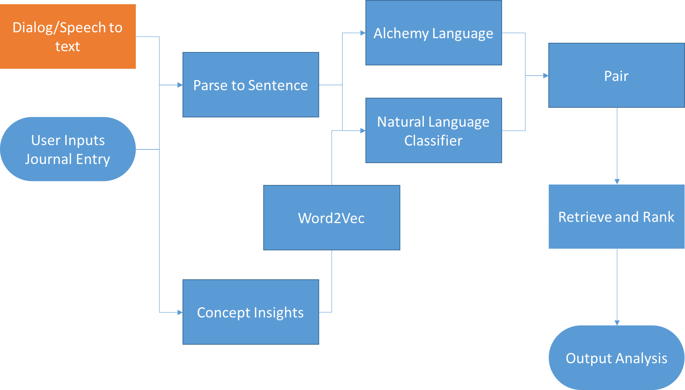

# Watson Developer Challenge
TeamNDL's repository for the Watson Developer Challenge

##H2 The Algorithm

##H2 Inputing Credentials
1. Create Directory 'credentials':
'''
touch credentials
'''
2. Create credential file:
'''json
{
  "NLC": {
  	"url": "{your_url}",
  	"password": "{your_pwd}",
  	"username": "{your_usr}"
  },
  "CI": {
    "url": "{your_url}",
    "password": "{your_pwd}",
    "username": "{your_usr}"
  }
}
'''
3. Add credential file to .gitignore